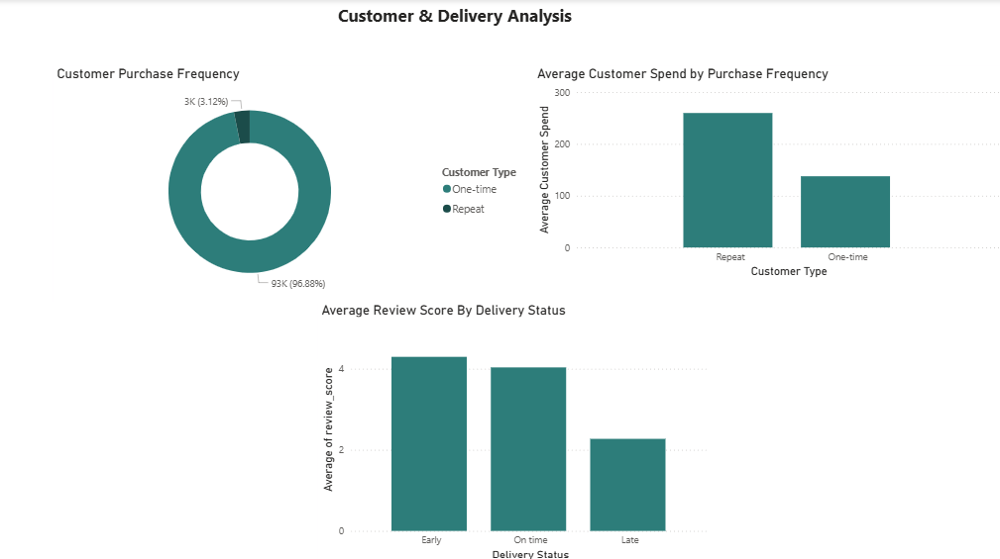
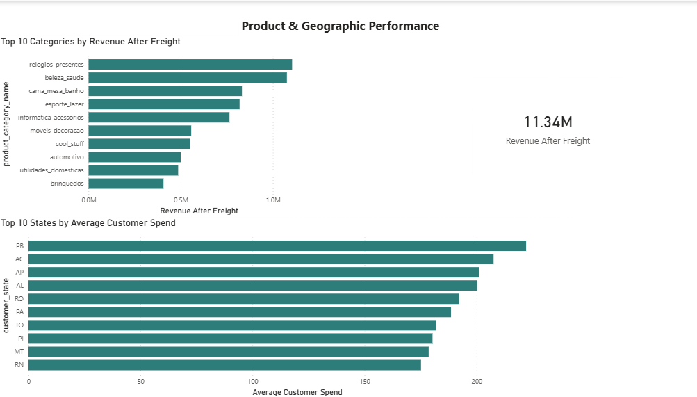

# Olist E-Commerce Analysis

## Project Overview

The Olist dataset is a large public dataset based on the operations of a Brazilian e-commerce marketplace, covering sales from 2016 to 2018.

The objective of this analysis was to investigate overall sales performance, customer behaviour, product performance and delivery outcomes, and to identify insights that could support business decision-making.

I used **SQL** to explore, validate and analyse the underlying data, investigating areas such as revenue, customer purchase frequency, delivery performance and product categories. I then used **Power BI** to develop a structured data model and interactive dashboard, transforming the findings from the SQL analysis into a clear business-facing report.

The analysis examined **revenue and sales trends, leading product categories, the impact of freight costs on revenue, customer purchase frequency and value, and the relationship between delivery performance and customer satisfaction**. I also sourced and integrated external regional income data to investigate whether differences in average customer spend were associated with regional economic conditions.

## Tools

- **SQL Server / SSMS** — data exploration, validation and analysis
- **Power BI** — data modelling, DAX and interactive visualisation
- **Power Query** — data cleaning and transformation
- **Excel** — supporting data preparation and analysis

## Business Questions

The analysis focused on the following questions:

1. How did sales performance change over time?
2. Which product categories and states generated the most sales?
3. Which categories generated the strongest revenue after freight costs?
4. How does customer purchase frequency affect customer value?
5. How does delivery performance relate to customer satisfaction?
6. Do customer spending patterns differ significantly between Brazilian states?
7. Is there an observable relationship between regional income levels and customer spending?

## Methodology

The analysis followed a two-stage approach:

### 1. Data exploration and analysis

SQL was used to explore the Olist dataset, validate relationships between tables and investigate the business questions. This included analysis of:

- Sales and order trends
- Product category performance
- Freight costs
- Customer purchase frequency and spending
- Delivery performance
- Customer review scores
- Geographic differences in customer spending

External regional income data was also integrated to provide additional context for the geographic analysis.

### 2. Data modelling and visualisation

The analysed data was then brought into Power BI, where I:

- Built a relational data model connecting customers, orders, products, sellers, payments and reviews
- Created calculated columns and DAX measures
- Used Power Query for data preparation and transformation
- Developed an interactive three-page dashboard focused on sales, customers, delivery, products and geographic performance

## Key Findings

- **Sales were concentrated among a relatively small group of leading categories.** Beauty & Health generated the highest gross revenue, while Watches & Gifts had a particularly strong combination of revenue, average order value and relatively low freight costs.

- **Freight costs changed the picture of category performance.** After subtracting freight costs, Watches & Gifts generated more revenue than Beauty & Health despite having lower gross sales, highlighting the importance of considering fulfilment costs alongside sales revenue.

- **Repeat customers were much more valuable overall.** Repeat customers represented only around 3% of unique customers, but their average total spend was approximately 1.9 times that of one-time customers. Their advantage came primarily from purchasing more frequently rather than from larger individual orders.

- **Delivery performance was strongly associated with customer satisfaction.** Orders delivered late received an average review score of approximately 2.3, compared with approximately 4.3 for orders delivered early. This suggests that delivery performance is an important factor in the customer experience.

- **Customer spending varied considerably between states.** Average customer spend differed substantially across Brazil, while the number of orders per customer varied only slightly. This indicates that geographic differences in spending were driven primarily by differences in order value rather than purchase frequency.

- **Regional income and customer spending did not move together in a simple way.** The analysis found that some lower-income states recorded relatively high average customer spending, while several higher-income states recorded lower spending. This is an observed association rather than evidence of a causal relationship.

## Dashboard

## Dashboard

The Power BI report is organised into three pages:

### 1. E-Commerce Performance Overview

An overview of sales performance, including monthly sales trends, total sales, order volume, customer count and leading product categories and states.

### 2. Customer & Delivery Analysis

An analysis of customer purchase frequency, customer value, delivery performance and the relationship between delivery outcomes and review scores.

### 3. Product & Geographic Performance

A deeper look at category performance after freight costs and differences in average customer spending across Brazilian states.

## Data Source

The analysis uses the **Brazilian E-Commerce Public Dataset by Olist**, a publicly available dataset containing information on orders, customers, products, sellers, payments and reviews from 2016 to 2018.

External regional income data from **IBGE** was also incorporated to provide additional context for the geographic analysis.

## Limitations

- The dataset covers a historical period from 2016 to 2018 and may not reflect current e-commerce behaviour.
- The dataset does not contain product cost, marketing expenditure or other operating costs, so revenue after freight should not be interpreted as profit.
- Customer retention analysis is affected by the relatively short observation period; customers acquired near the end of the dataset had less time to make repeat purchases.
- The relationship between regional income and customer spending is observational and does not establish causation.
